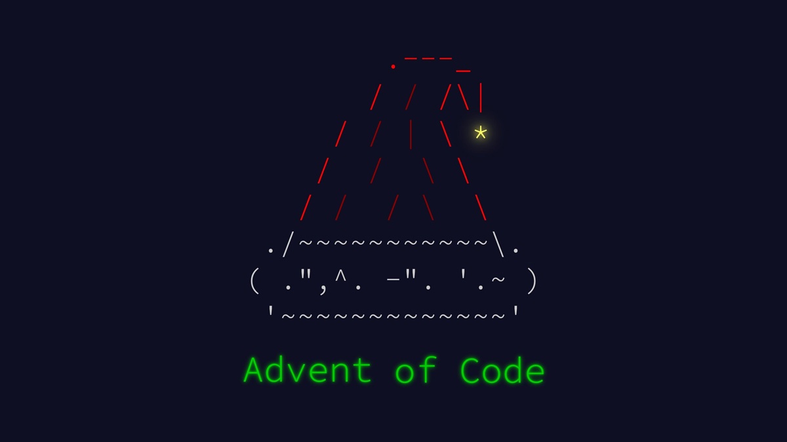

<div align="center">
  


# 🎄 Advent of Code 2025 🎄

[](https://adventofcode.com/2025)
[](https://www.python.org/)
[]()
[]()
```markdown
<div align="center">
  
  # Advent of Code 2025 — My Solutions

  [](https://adventofcode.com/2025)
  [](https://www.python.org/)

</div>

## About

This repository contains my solutions for Advent of Code 2025, written in Python. This is my second year participating — I use the event to practice algorithms, write clear code, and explore problem-solving techniques.

## Highlights for 2025

- 12 puzzle days (shorter format this year)
- No global leaderboard — emphasis on learning and collaboration
- Same engaging puzzles and holiday-themed stories

## Repository Layout

Each day has its own folder with the puzzle input and solution files:

```
Advent of Code 2025/
├─ AOC.jpg
├─ README (2).md
├─ Day 1/
│  ├─ input.txt
│  ├─ part1.py
  │  └─ part2.py
└─ Day 2/
   ├─ input.txt
   ├─ part1.py
   └─ part2.py
```

## Run a solution

From the repository root (PowerShell example):

```powershell
cd "Day 1"
python part1.py
python part2.py
```

Each script reads its `input.txt` from the same folder.

## Progress

I update this table as I complete parts.

| Day | Part 1 | Part 2 | Notes |
|-----|:------:|:------:|-------|
| 1   | ✅     | ✅     | Completed |
| 2   | ⬜     | ⬜     | Pending |
| 3   | ⬜     | ⬜     | Pending |

## Notes

- Code focuses on clarity and reasonable efficiency.
- Want CI or tests added? I can set that up.

```